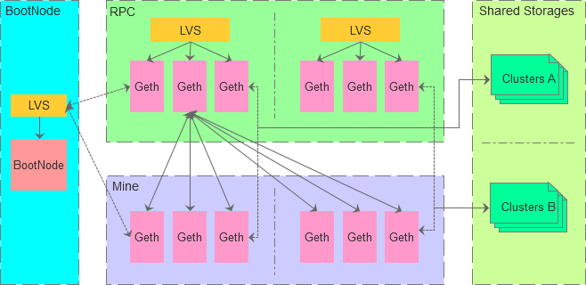

# Docker Ethereum

本项目旨在建立基于Docker部署的生产环境使用的Ethereum私链集群，在尽可能简化使用的前提下保留足够的灵活性，方便业务快速组建区块链私有网络集群，并基于此开发私有区块链平台应用。

因用到了“多阶段镜像构建”的特性，需要Docker 17.05 以上的版本 编译镜像。

### 支持的环境变量

我们的Docker镜像做到了开箱即用，但为了能让业务使用特有的配置，我们提供了一些环境变量，可在启动容器时指定并修改默认值。支持的环境变量如下表所列：

| 变量名 | 默认值 | 说明 |
|----------|------|------|
| HOSTNAME | `localhost` | 容器的主机名 |
| ETHEREUM_HOME | `/usr/local/ethereum` | 集群根目录 |
| ETHEREUM_DATADIR | `${ETHEREUM_HOME}/data` | 集群数据目录 |
| ETHEREUM_GENESIS_JSON | `${ETHEREUM_DATADIR}/genesis.json` | 初始化文件路径 |
| ETHEREUM_BOOTNODE_KEY | `${ETHEREUM_DATADIR}/bootnode.key` | 启动节点的key文件路径 |
| ETHEREUM_NODE_DATADIR | `${ETHEREUM_DATADIR}/nodes/${HOSTNAME}` | 节点数据目录 |
| ETHEREUM_NODE_INITFLAG | `${ETHEREUM_NODE_DATADIR}/init.SUCCESS` | 节点初始化标志文件 |
| ETHEREUM_NODE_ROLE | `mine` | 节点角色 |

### 节点角色

* 启动节点 bootnode

    启动节点是用来帮助网络中其他节点发现彼此进而连接彼此的引导节点，容器中启动的是专用的`bootnode`程序，通过 `ETHEREUM_BOOTNODE_KEY` 环境变量指定启动时所需的key文件。

    因bootnode是高性能轻量级的程序，一般启动一个bootnode角色的容器即可。

* 挖矿节点 mine

    顾名思义，挖矿节点是用来实际挖矿产生区块并记录数据到区块链上的节点，容器中启动的是`geth`程序，通常需要跨多个机房部署4个以上挖矿节点组成集群。

    启动时须指定 --networkid 、--etherbase、--bootnodes 等命令参数。

* 接口节点 rpc

    接口节点是用来处理业务方接口请求的节点，接口节点和挖矿节点互相链接，容器中启动的是`geth`程序，通常需要在与调用业务方相同的机房部署多个挖矿节点组成集群。接口节点和挖矿节点拆分开是为了提高接口吞吐量和避免和挖矿节点互相干扰。

    启动时须指定和挖矿节点相同的 --networkid 、--bootnodes 等命令参数。

### 集群架构示例

### 自定义配置

项目代码中data目录有仅供测试的配置文件，如 bootnode.key 和 genesis.json，可自行修改后再做编译，
也可挂载有自定义配置的共享存储到容器内的`/usr/local/ethereum/data`目录 覆盖配置文件

